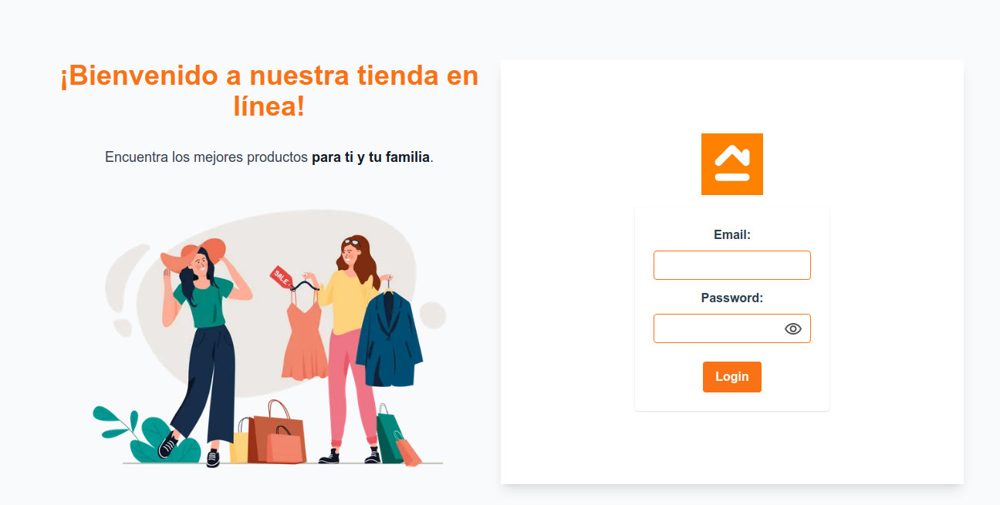

# Ecommerce

Este es un proyecto de ecommerce desarrollado con Vue.js y Firebase.
## Funcionalidades

- Inicio de sesión de usuarios
- Añadir productos al carrito de compras
- Ver detalle del producto

## Tecnologias empleadas

   ✅ Vue, Vuex <br />
   ✅ Tailwind <br />
   ✅ Styled Component Vue <br />
   ✅ Firebase Hoisting <br />
   ✅ SweetAlert <br />
   ✅ API (FakeStoreApi)

## Demo

Puede ver una demostración en vivo de la aplicación aquí: [Ecommerce](https://ecommerce-869fa.web.app/)

<div align="center">

| EMAIL | CONTRASEÑA | 
|--|--|
|usuario1@gmail.com|123456|
|usuario1@gmail.com|789456|

</div>


## Instalación

1. Clonar el repositorio
2. Instalar las dependencias con `npm install`

## Uso

1. Iniciar el servidor local con `npm run serve`
2. Acceder a `http://localhost:8080` en el navegador

```js
npn run serve
```
## Deploy en Firebase Hosting

1. Crear una cuenta en Firebase y crear un proyecto.

2. Configurar las variables de entorno en un archivo .env en la raíz del proyecto.

```js
VUE_APP_API_KEY=xxxx
VUE_APP_AUTH_DOMAIN=xxxx
VUE_APP_PROJECT_ID=xxxx
VUE_APP_STORAGE_BUCKET=xxxx
VUE_APP_MESSAGING_SENDER_ID=xxxx
VUE_APP_APP_ID=xxxx
```
3. Configurar el proyecto en Firebase.


```js
firebase init
```
4. Seleccionar las opciones de Hosting y Functions.

5. Especificar la carpeta dist como carpeta pública.

6. Compilar el proyecto.

```js
npm run build
```

7. Deploy del proyecto en Firebase Hosting.
```js
firebase deploy
```
## Autor 👩‍💻
- [Merly Anco](https://github.com/MerlyAnco) 